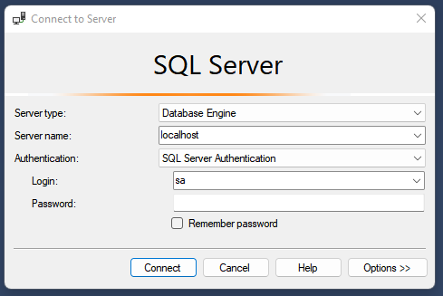

# FutureSQC WebApp Environment

# Installation

## Requirements:
Preamble: to avoid dependency errors and missmatches, every package required to run this project
is locked, declared and tracked using a Pipenv Pipfile. Everything runs and builds inside Docker containers,
so, before launching the server make sure to:

1. (Optional) Have a functioning WSL2 environment, preferably under Ubuntu >=20.04 for convinience sake
2. Have docker and docker-compose installed
3. Have python >=3.10 installed as well as pipenv and pyenv
4. Have MSSQL Management Studio installed
5. (Optional) Have the latest version of VSCode Installed. Useful for dev utils such as linter.

## Installation steps:
1. ### Clone the repo (be sure to have proper authorization).
Using git ssh:

```bash
git clone git@github.com:sickb0i/futuresqc-back.git
```

2. ### Go to the repo, install dependencies, make your local .env file for credentials
```bash 
cd futuresqc-back
pipenv install
cp .env.example .env
```
Note: be sure your sapassword.env matches your `CONFIG_DATABASE_PASSWORD` and `DATA_DATABASE_PASSWORD` variables inside your .env file

3. ### Build and run the docker images
```bash
docker-compose up --build
```

4. ### Import `FSQC50_CONFIG` and `FSQC50_TABLAS` databases via MSSQL Management Studio

    1. Authenticate to the MsSQL db you just launched, in following screen fill form as such. Password is the same you declared in your .env file

    

    2. Go to databases > right click restore database > find in your local files

5. ### Re build and restart your docker containers
```bash
docker-compose up --build
```